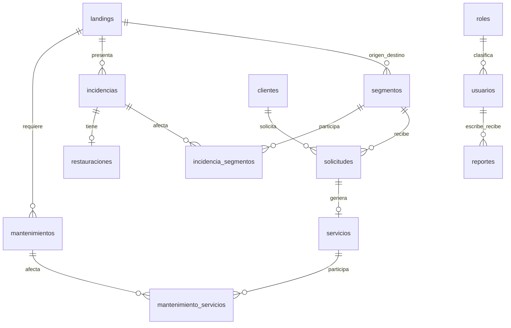

# Base de datos de demostración de OceanLink

Diseño para MySQL 8.0.16 o superior, basado en `bd.txt` y en las vistas JSP de `web` del `main` local, commit `cdd49aa`. La rama de trabajo era `gepete`, pero su carpeta `web` no presentaba diferencias respecto de `main`. No se consultó el remoto ni se modificaron las pantallas.

## Cómo abrirla

1. Abre MySQL Workbench y tu conexión local.
2. Abre `oceanlink_demo.sql` con **File → Open SQL Script**.
3. Si todavía no existe `oceanlink_demo`, ejecuta el archivo completo. Si ya está instalada, pasa directamente al siguiente paso. El instalador es de una sola ejecución: no es una migración ni debe volver a ejecutarse sobre la base existente.
4. Actualiza **Schemas** y expande `oceanlink_demo`: encontrarás 13 tablas y 4 vistas.
5. Abre `consultas_demo.sql` y ejecuta las consultas individualmente o todas juntas.

El archivo `.sql` también se puede abrir con Bloc de notas. No contiene contraseñas del servidor, no crea cuentas MySQL y no borra bases existentes. `oceanlink_db`, la base nombrada en tu borrador, queda separada.

**Estado de entrega:** instalada y verificada en el MySQL local 8.0.46 el 18/09/2026, sin conectar la plataforma. No necesitas ejecutar otra vez el instalador en esta máquina. Todas las consultas se ejecutaron correctamente; sus resultados están en `resultado_consultas.txt`. Los cuatro controles de consistencia devolvieron cero errores. También se comprobó el rechazo de capacidad negativa, extremos de segmento iguales, rol inexistente, usuario duplicado, cierre sin fecha, servicio activo con fecha de fin y mantenimiento finalizado sin actividades. Estas pruebas se realizaron dentro de transacciones sin conservar cambios.

## Qué cubre

| Pantallas | Tablas o vistas principales |
|---|---|
| Administrador: usuarios | `roles`, `usuarios` |
| Administrador: landings y segmentos | `landings`, `segmentos`, `v_capacidad_segmentos` |
| Capacity Planner: clientes y solicitudes | `clientes`, `solicitudes`, `servicios` |
| Capacity Planner: reservas e historial | `segmentos.capacidad_reservada_gbps`, `v_servicios_clientes` |
| Network Operator: incidencias e historial | `incidencias`, `incidencia_segmentos`, `v_clientes_afectados` |
| Network Operator: restauraciones | `restauraciones` |
| Maintenance Coordinator: registro y seguimiento | `mantenimientos`, `mantenimiento_servicios` |
| Supervisor: resumen y reportes | `v_resumen_red`, `reportes` |

Las tablas intermedias permiten que una incidencia afecte varios segmentos y que un mantenimiento afecte varios servicios. No se guardan listas separadas por comas en las tablas. El historial se consulta sobre los registros cerrados o caducados; no necesita copias en otras tablas.

El diagrama resume las relaciones del negocio. El SQL también relaciona usuarios responsables con solicitudes, incidencias, restauraciones y mantenimientos, y conserva el rol del autor de cada reporte.

## Decisiones para mantenerlo sencillo

- Se conservan los cinco roles de tu borrador, con los mismos identificadores. Los usuarios de ejemplo no tienen contraseña habilitada (`password_hash = NULL`). Cuando conecten el inicio de sesión, el backend deberá rechazar valores NULL y guardar hashes con una biblioteca de contraseñas, nunca contraseñas en texto plano.
- Toda capacidad se guarda en **Gbps** con tres decimales. Administración puede mostrar **Tbps dividiendo entre 1000**.
- **Disponible = total − servicios activos − reserva**. El uso es capacidad contratada, no tráfico medido; esto respeta el alcance de gestión del README del proyecto.
- La reserva es una bolsa global por segmento, como en `reservas.jsp`; no está asignada a un cliente. Una solicitud pendiente no consume capacidad. Al crear un servicio se consume capacidad libre; si se usa la bolsa reservada, hay que reducirla en la misma transacción.
- Se calcula la utilización como uso / total. Los niveles del Supervisor son: bajo < 80 %, alto entre 80 % y < 90 %, crítico ≥ 90 %. El estado operativo del segmento es un dato distinto.
- Los clientes pueden contratar varios segmentos mediante solicitudes distintas. Una solicitud genera como máximo un servicio. Tras provisionarla, sus campos de cliente, segmento y capacidad deben quedar fijos para conservar el contrato y el historial.
- La solicitud registra el trámite; el servicio registra vigencia. El estado `Provisionada` de solicitudes históricas indica que se atendieron; el servicio asociado informa si caducaron. Las cinco solicitudes vigentes están `Activa`.
- Se unifica **En atención** del Supervisor con **En reparación** del operador. Se incluye severidad **Crítica**, aunque falta en el selector del operador. Al conectar las pantallas deberán compartir esos mismos valores.
- Una restauración por incidencia, con fecha programada y fecha real separadas. Una restauración completada debe cerrar la incidencia en la misma transacción.
- La ubicación del mantenimiento se obtiene del landing. La duración se almacena en minutos. Para finalizarlo se exige fecha de fin y actividades realizadas.
- Los destinatarios de reportes son usuarios internos. Guardar un reporte no envía correos; ese envío sería una funcionalidad adicional.
- Las claves foráneas impiden eliminar registros con dependencias. Para mantener historial, conviene desactivar usuarios/clientes y cerrar incidencias o servicios en lugar de borrarlos.

## Datos para mostrar al JP

Se incluyen 5 usuarios, 8 landings, 5 segmentos, 3 clientes, 11 solicitudes, 7 servicios (5 activos y 2 caducados), 4 incidencias (3 abiertas), 2 restauraciones, 4 mantenimientos y 3 reportes. Los datos son ficticios y están situados alrededor de septiembre de 2026.

Las maquetas no comparten cifras consistentes: Capacity Planner usa segmentos de 500 Gbps, mientras Supervisor muestra otros totales; además, la reserva de 50 Gbps del tercer segmento más sus 465 Gbps de uso superaría 500. Para la demo se adoptaron los 500 Gbps del Planner y se ajustó esa reserva a 20 Gbps. Se añadieron dos segmentos regionales para representar las landings del Administrador. No se pretende representar rutas físicas reales.

| Segmento | Total Gbps | Uso Gbps | Reserva Gbps | Disponible Gbps |
|---|---:|---:|---:|---:|
| SEG-001 | 500 | 100 | 20 | 380 |
| SEG-002 | 500 | 400 | 30 | 70 |
| SEG-003 | 500 | 465 | 20 | 15 |
| SEG-004 | 200 | 80 | 10 | 110 |
| SEG-005 | 200 | 60 | 0 | 140 |
| **Total** | **1900** | **1105** | **80** | **715** |

Guion corto: muestra primero el resumen (58.16 % de uso), luego el segmento 3 con 93 % de uso, la solicitud de 100 Gbps que queda pendiente porque el segmento 2 solo tiene 70 disponibles, los dos servicios caducados de SIES y la incidencia cerrada con su restauración. Termina mostrando mantenimientos y reportes por responsable.

## Al conectar la plataforma

Las JSP actuales son maquetas: instalar esta base **no hace que las páginas lean ni guarden datos automáticamente**. Faltará implementar la conexión JDBC, las consultas y los controladores de formularios. No se incluyen cambios al backend en esta entrega.

La base valida claves, duplicados, capacidades positivas, fechas y estados de cada fila. Para mantener el diseño sencillo, las siguientes reglas entre varias tablas deberán implementarse en el backend mediante transacciones:

1. Antes de activar un servicio, cambiar una reserva o reducir el total de un segmento, bloquear su fila con `SELECT ... FOR UPDATE`, volver a calcular uso y disponibilidad y rechazar sobreasignaciones. Todos los caminos de escritura deben respetar ese bloqueo. No basta con consultar la disponibilidad antes de abrir la transacción.
2. Validar que el cliente y los responsables estén activos, que sus roles permitan la acción y que el segmento sea utilizable antes de una nueva provisión.
3. Verificar que segmentos de una incidencia y servicios de un mantenimiento correspondan al landing seleccionado.
4. Al completar una restauración, validar fechas contra la detección y actualizar el cierre de la incidencia en la misma transacción.
5. Mantener la coherencia de solicitud y servicio al provisionar o terminar contratos. La vista usa el estado del servicio; no hay tareas automáticas que cambien estados por fecha.

La base por sí sola no impide una sobreasignación mediante SQL directo ni valida roles de responsables. Las últimas consultas de `consultas_demo.sql` detectan inconsistencias de capacidad, infraestructura y restauraciones. Esta separación es deliberada para una primera entrega académica pequeña.
